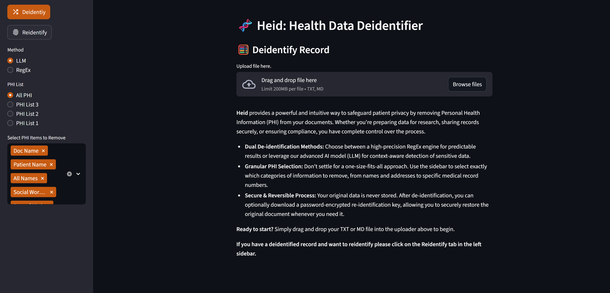

# 🧬 Heid: A Secure Health Data De-identifier

[](https://www.python.org/downloads/)
[](https://streamlit.io)
[](https://opensource.org/licenses/MIT)

> **[VISIT LIVE APP](https://ehr-deidentify.streamlit.app/)**

Heid is a powerful and intuitive web application that safeguards patient privacy by removing Personal Health Information (PHI) from medical records. It offers a secure, reversible process with user-selectable de-identification methods, giving users complete control over their data.

 

## ✨ Key Features

*   **🔐 Dual De-identification Methods**: Users can choose between two powerful methods:
    *   **AI-Powered (LLM)**: Leverages the Google Gemini API for advanced, context-aware detection and removal of sensitive data.
    *   **RegEx-Based**: Utilizes a high-precision, custom-built RegEx engine for fast, predictable, and reliable pattern matching.
*   **🎛️ Granular PHI Selection**: Go beyond one-size-fits-all solutions. Users can choose from pre-configured lists or manually select over 25 specific categories of PHI to remove.
*   **🔑 Secure & Reversible Process**: The application never stores user data. After de-identification, users can download a re-identification map, which is encrypted with a user-provided password using the robust Fernet symmetric encryption scheme.
*   **🔒 Strong Encryption**: The re-identification key is secured using a password-derived key (PBKDF2HMAC with SHA256) and a unique salt, protecting it against brute-force and rainbow table attacks.
*   **🖥️ User-Friendly Interface**: A clean and intuitive UI built with Streamlit guides the user through uploading, configuring, de-identifying, and re-identifying their documents.

## 🛠️ Technology Stack

*   **Application Framework**: Streamlit
*   **Language**: Python
*   **AI/LLM**: Google Gemini API
*   **Encryption**: Python `cryptography` library (Fernet, PBKDF2HMAC)
*   **Text**: PyYAML, RegEx

## 🚀 Getting Started

Follow these instructions to get a local copy up and running.

### Prerequisites

*   Python 3.9 or higher
*   A Google Gemini API Key. You can get one from [Google AI Studio](https://aistudio.google.com/app/apikey).

### Installation

1.  **Clone the repository:**
    ```sh
    git clone https://github.com/your-username/heid.git
    cd heid
    ```

2.  **Create and activate a virtual environment (recommended):**
    ```sh
    # For macOS/Linux
    python3 -m venv venv
    source venv/bin/activate

    # For Windows
    python -m venv venv
    .\venv\Scripts\activate
    ```

3.  **Install the required dependencies:**
    ```sh
    pip install -r requirements.txt
    ```

4.  **Set up your environment variables:**
    *   Create a file named `.env` in the root directory of the project.
    *   Add your Google Gemini API key to this file:
    ```
    GOOGLE_API_KEY="YOUR_API_KEY_HERE"
    ```

### Running the Application

Launch the Streamlit app with the following command:
```sh
streamlit run app.py
```
Open your web browser and navigate to `http://localhost:8501`.

## ⚙️ How It Works

### De-identification Process

1.  **File Upload**: The user uploads a `.txt` or `.md` file containing the health record.
2.  **Method Selection**: The user chooses between the **LLM** or **RegEx** method in the sidebar.
3.  **PHI Selection**: The user selects the specific categories of PHI they wish to remove.
4.  **Processing**:
    *   If **LLM** is chosen, a detailed prompt is constructed and sent to the Google Gemini API, which returns a de-identified version of the text.
    *   If **RegEx** is chosen, the application runs the text through a series of custom regular expressions.
5.  **Map Creation**: The application compares the original and de-identified texts to create a re-identification map assigning original data to placeholder tags (e.g., `[NAME#1]`), which is then securely encrypted before download.
6.  **Output**: The user is shown the de-identified text and can download it.

### Re-identification & Security

1.  **Key Generation**: If the user chooses to download the re-identification map, they must provide a password.
2.  **Key Derivation**: A secure 32-byte encryption key is derived from the user's password using **PBKDF2HMAC** with a 16-byte random salt and 100,000 iterations. This prevents simple password cracking.
3.  **Encryption**: The re-identification map is then encrypted using this key with the **Fernet** (AES-128 in CBC mode) symmetric encryption algorithm.
4.  **Restoration**: To re-identify a document, the user must provide the de-identified text, the encrypted `.map` file, and the correct password. The application uses the password to decrypt the map and restore the original record, which the user may view and download.

## 📄 License

Distributed under the MIT License. See `LICENSE` for more information.
